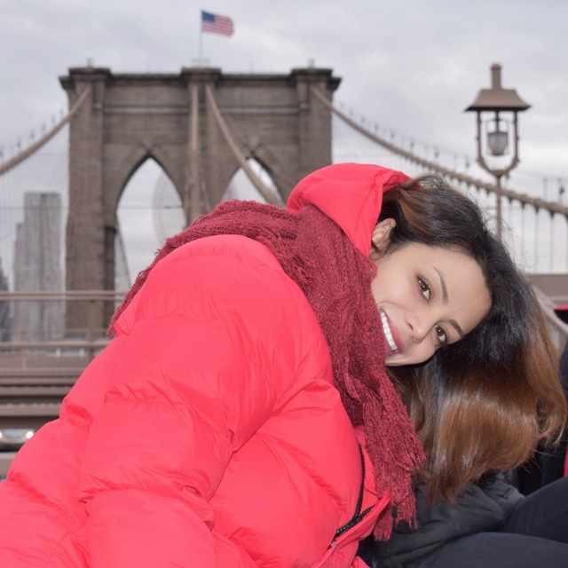

# README

<https://usf-cs360-spring2020.github.io/template-bulma/>

**Name:** Parisa Hemmati
**Email:** <phemmati@dons.usfca.edu>

I am a Computer Science graduate student with experience on Wireless protocol development. Beside programming enthusiastic, I am a globetrotter who loves to travel to different part of the world. I have traveled to more than 30 countries up to now and still counting. Reading books and playing piano are my hobbies.

*Template based on: <https://github.com/usf-cs360-spring2020/template-bulma>*
